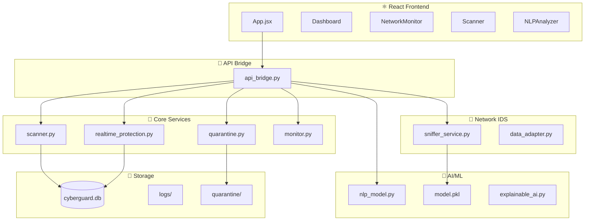

# AEGIS Project Report

**AEGIS Cyber Defense** — A comprehensive Host & Network Intrusion Detection System with real-time protection, ML-based threat analysis, and modern React UI.

---

## Technology Stack

| Layer | Technologies |
|-------|--------------|
| **Backend** | Python 3.x, pywebview, SQLite |
| **Frontend** | React 19, Tailwind CSS, Recharts, Framer Motion |
| **AI/ML** | scikit-learn, SHAP (explainable AI), NLP |
| **Security** | YARA rules, Scapy (network), cryptography |
| **Build** | Vite, PyInstaller |

---

## Project Structure

```
CGP-2/
├── main_aegis.py          # 🚀 Primary entry point (React UI)
├── main.py                # Legacy Tkinter GUI entry point
├── requirements.txt       # Python dependencies
├── cyberguard.db          # SQLite database
│
├── core/                  # 🔧 Core Backend Modules
├── ai/                    # 🤖 AI/ML Models
├── security/              # 🔐 Security & Encryption
├── database/              # 💾 Database Management
├── gui/                   # 🖥️ Legacy Tkinter GUI
├── ui/frontend/           # ⚛️ React Frontend
├── tests/                 # 🧪 Test Suites
├── data/                  # 📁 App Data Storage
├── logs/                  # 📋 Log Files
├── quarantine/            # 🔒 Quarantined Files
└── build/                 # 📦 Build Artifacts
```

---

## Core Modules (`core/`)

| File | Purpose |
|------|---------|
| [api_bridge.py](file:///c:/xampp/htdocs/CGP-2/core/api_bridge.py) | **API Bridge** — Exposes Python backend to React via pywebview. Contains all `window.pywebview.api.*` methods |
| [realtime_protection.py](file:///c:/xampp/htdocs/CGP-2/core/realtime_protection.py) | **RTP Engine** — File system watcher using watchdog. Detects file changes and triggers threat scans |
| [scanner.py](file:///c:/xampp/htdocs/CGP-2/core/scanner.py) | **File Scanner** — Multi-engine scanner with hash checking, YARA rules, and heuristic analysis |
| [quarantine.py](file:///c:/xampp/htdocs/CGP-2/core/quarantine.py) | **Quarantine Manager** — Encrypts and isolates infected files, supports restore/delete |
| [threat_prevention.py](file:///c:/xampp/htdocs/CGP-2/core/threat_prevention.py) | **Threat Prevention** — Blocks malicious processes and network connections |
| [monitor.py](file:///c:/xampp/htdocs/CGP-2/core/monitor.py) | **System Monitor** — Tracks CPU, memory, disk usage via psutil |
| [system_logger.py](file:///c:/xampp/htdocs/CGP-2/core/system_logger.py) | **Logger** — Centralized logging to files and database |
| [native_notifications.py](file:///c:/xampp/htdocs/CGP-2/core/native_notifications.py) | **OS Notifications** — Windows toast notifications for threat alerts |
| [notification_window.py](file:///c:/xampp/htdocs/CGP-2/core/notification_window.py) | **Popup Notifications** — Custom Tkinter notification popups |

### Network Submodule (`core/network/`)

| File | Purpose |
|------|---------|
| [sniffer_service.py](file:///c:/xampp/htdocs/CGP-2/core/network/sniffer_service.py) | **NIDS Engine** — Threaded network packet sniffer using Scapy with ML-based threat detection |
| [data_adapter.py](file:///c:/xampp/htdocs/CGP-2/core/network/data_adapter.py) | **Data Preprocessor** — Standardizes network flow data for ML model input (78-feature vector) |

### Rules Submodule (`core/rules/`)

| File | Purpose |
|------|---------|
| [malware_rules.yar](file:///c:/xampp/htdocs/CGP-2/core/rules/malware_rules.yar) | **YARA Rules** — Pattern-matching rules for malware signatures |

---

## AI/ML Modules (`ai/`)

| File | Purpose |
|------|---------|
| [nlp_model.py](file:///c:/xampp/htdocs/CGP-2/ai/nlp_model.py) | **NLP Threat Detector** — Analyzes text for phishing, scams, PII leakage using regex + heuristics |
| [explainable_ai.py](file:///c:/xampp/htdocs/CGP-2/ai/explainable_ai.py) | **SHAP Explainer** — Provides human-readable explanations for ML predictions |
| [train_nlp.py](file:///c:/xampp/htdocs/CGP-2/ai/train_nlp.py) | **Training Script** — Trains NLP models on threat datasets |

### Models Subdir (`ai/models/`)

| File | Purpose |
|------|---------|
| `model.pkl` | Trained scikit-learn classifier for network intrusion detection |
| `scaler.pkl` | Feature scaler (StandardScaler) for normalizing input data |

---

## Security Modules (`security/`)

| File | Purpose |
|------|---------|
| [password_manager.py](file:///c:/xampp/htdocs/CGP-2/security/password_manager.py) | **Password Vault** — Encrypted password storage with master key |
| [encryption.py](file:///c:/xampp/htdocs/CGP-2/security/encryption.py) | **Encryption Utils** — AES-256 encryption for quarantine and passwords |
| [auth.py](file:///c:/xampp/htdocs/CGP-2/security/auth.py) | **Authentication** — User login/session management |

---

## Database (`database/`)

| File | Purpose |
|------|---------|
| [db_manager.py](file:///c:/xampp/htdocs/CGP-2/database/db_manager.py) | **DB Manager** — SQLite CRUD operations for all app data |
| [schema.sql](file:///c:/xampp/htdocs/CGP-2/database/schema.sql) | **Schema Definition** — Tables: users, passwords, quarantine, system_events, scan_results |
| [migrate_quarantine.py](file:///c:/xampp/htdocs/CGP-2/database/migrate_quarantine.py) | **Migration Script** — Database schema upgrades |

---

## React Frontend (`ui/frontend/src/`)

### Entry Points

| File | Purpose |
|------|---------|
| [main.jsx](file:///c:/xampp/htdocs/CGP-2/ui/frontend/src/main.jsx) | React app entry point |
| [App.jsx](file:///c:/xampp/htdocs/CGP-2/ui/frontend/src/App.jsx) | Main app with sidebar navigation and tab routing |
| [index.css](file:///c:/xampp/htdocs/CGP-2/ui/frontend/src/index.css) | Global Tailwind styles and custom theme |

### Components (`ui/frontend/src/components/`)

| Component | Purpose |
|-----------|---------|
| [Dashboard.jsx](file:///c:/xampp/htdocs/CGP-2/ui/frontend/src/components/Dashboard.jsx) | **Home Dashboard** — RTP status, system stats, threat activity chart |
| [NetworkMonitor.jsx](file:///c:/xampp/htdocs/CGP-2/ui/frontend/src/components/NetworkMonitor.jsx) | **NIDS Monitor** — Network traffic graph, packet stats, live threat feed |
| [Scanner.jsx](file:///c:/xampp/htdocs/CGP-2/ui/frontend/src/components/Scanner.jsx) | **File Scanner UI** — Quick/Full/Custom scan with progress |
| [NLPAnalyzer.jsx](file:///c:/xampp/htdocs/CGP-2/ui/frontend/src/components/NLPAnalyzer.jsx) | **Threat AI** — Text analysis for phishing/scam detection |
| [PasswordManager.jsx](file:///c:/xampp/htdocs/CGP-2/ui/frontend/src/components/PasswordManager.jsx) | **Password Vault UI** — Add/view/delete passwords |
| [Quarantine.jsx](file:///c:/xampp/htdocs/CGP-2/ui/frontend/src/components/Quarantine.jsx) | **Quarantine Viewer** — Manage isolated threats |
| [Reports.jsx](file:///c:/xampp/htdocs/CGP-2/ui/frontend/src/components/Reports.jsx) | **Reports** — Scan history and logs |
| [Settings.jsx](file:///c:/xampp/htdocs/CGP-2/ui/frontend/src/components/Settings.jsx) | **App Settings** — Configuration options |
| [ThreatAlertManager.jsx](file:///c:/xampp/htdocs/CGP-2/ui/frontend/src/components/ThreatAlertManager.jsx) | **Alert Manager** — Polls for RTP threat alerts |
| [ThreatAlertDialog.jsx](file:///c:/xampp/htdocs/CGP-2/ui/frontend/src/components/ThreatAlertDialog.jsx) | **Alert Dialog** — Modal for threat details |
| [ThreatNotification.jsx](file:///c:/xampp/htdocs/CGP-2/ui/frontend/src/components/ThreatNotification.jsx) | **Toast Notifications** — Animated threat popups |

---

## Legacy GUI (`gui/`)

| File | Purpose |
|------|---------|
| [dashboard.py](file:///c:/xampp/htdocs/CGP-2/gui/dashboard.py) | Legacy Tkinter dashboard (184KB, comprehensive) |
| [login.py](file:///c:/xampp/htdocs/CGP-2/gui/login.py) | Tkinter login screen |
| [popup_alerts.py](file:///c:/xampp/htdocs/CGP-2/gui/popup_alerts.py) | Custom popup alert windows |
| [styles.py](file:///c:/xampp/htdocs/CGP-2/gui/styles.py) | Tkinter styling constants |

---

## Test Files

| File | Tests |
|------|-------|
| [test_aegis_integration.py](file:///c:/xampp/htdocs/CGP-2/test_aegis_integration.py) | Full API integration tests (11 tests) |
| [test_realtime_protection.py](file:///c:/xampp/htdocs/CGP-2/test_realtime_protection.py) | RTP module tests |
| [test_quarantine.py](file:///c:/xampp/htdocs/CGP-2/test_quarantine.py) | Quarantine encryption tests |
| [test_prevention.py](file:///c:/xampp/htdocs/CGP-2/test_prevention.py) | Threat prevention tests |
| [test_yara_scan.py](file:///c:/xampp/htdocs/CGP-2/test_yara_scan.py) | YARA rule scanning tests |
| [test_nlp_pii.py](file:///c:/xampp/htdocs/CGP-2/test_nlp_pii.py) | NLP PII detection tests |

---

## Configuration & Build

| File | Purpose |
|------|---------|
| `requirements.txt` | Python package dependencies |
| `BUILD.bat` | Windows build script |
| `build_exe.py` | PyInstaller build configuration |
| `CyberGuardPro.spec` | PyInstaller spec file |
| `setup.py` | Package setup script |

---

## Architecture Diagram



---

*Generated: 2026-01-13*
