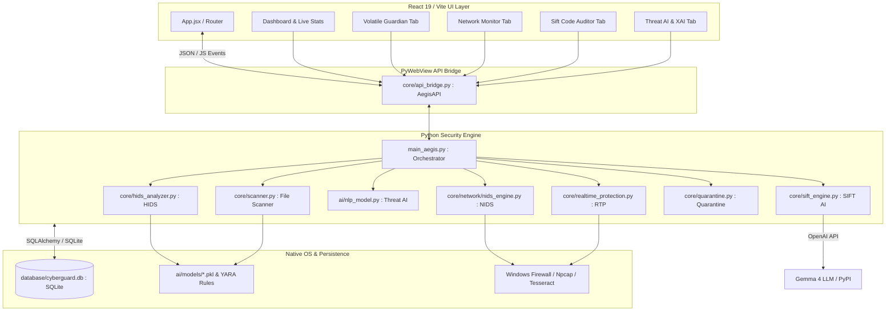

# AEGIS — Advanced Endpoint Guard & Intelligence System

<div align="center">


**A next-generation desktop cybersecurity suite combining traditional signature detection, machine learning intrusion analysis, and real-time LLM code auditing with a sleek React 19 interface.**

</div>

---

## Executive Summary

**AEGIS (Advanced Endpoint Guard & Intelligence System)** is a comprehensive, multi-layered desktop security platform built to defend modern Windows endpoints against zero-day exploits, fileless malware, network intrusions, social engineering, and software supply-chain poisoning.

Unlike traditional antivirus suites that rely solely on static signatures, AEGIS implements a **hybrid defense architecture**:
1. **Host-Based Intrusion Detection (HIDS / Volatile Guardian):** Uses Machine Learning models trained on Windows Portable Executable (PE) Import Address Table (IAT) sequences to catch packed and obfuscated executables.
2. **Real-Time Network Intrusion Detection (RT-XNIDS):** Captures live packet streams via Scapy, computes dynamic traffic baselines, and actively blocks malicious IPs through an automated Intrusion Prevention System (IPS).
3. **LLM-Powered Code Auditing (SIFT):** Integrates the `Google Gemma 4` Large Language Model (via OpenRouter) with static AST analysis and real-time PyPI registry checks to identify code vulnerabilities and slopsquatting/hallucinated dependencies.
4. **Explainable AI (XAI) Threat Detection:** Bilingual (English & Bangla) Natural Language Processing (NLP) engine that identifies phishing and social engineering attacks while highlighting contributing keywords with interpretability scores.

---

## Core Defense Pillars & Features

```
+-----------------------------------------------------------------------------------+
|                                 AEGIS DEFENSE CORE                                |
+-------------------------+-------------------------------+-------------------------+
|   Volatile Guardian     |          RT-XNIDS             |       SIFT Auditor      |
|  (PE IAT ML Analysis)   |    (Real-Time Packet IPS)     | (LLM Code & PyPI Check) |
+-------------------------+-------------------------------+-------------------------+
|     Threat AI (NLP)     |      Multi-Engine Scanner     |  Real-Time Protection   |
| (English & Bangla XAI)  |   (YARA / Hashes / Heuristic) |   (Screen OCR & Memory) |
+-------------------------+-------------------------------+-------------------------+
|   Secure Password Vault |      Automated Quarantine     |     System Monitor      |
|     (AES-256-GCM)       |    (Encrypted Isolation)      | (CPU / Ram / Processes) |
+-------------------------+-------------------------------+-------------------------+
```

### 1. Volatile Guardian (Host Intrusion Detection - HIDS)
* **PE Binary Analysis:** Inspects Windows Portable Executable (PE) headers and extracts the Import Address Table (IAT).
* **API Sequence Mapping:** Tracks 100 critical Windows API functions (`VirtualAlloc`, `CreateRemoteThread`, `WriteProcessMemory`, `LoadLibrary`, etc.) mapped to standardized feature vectors (`t_0` through `t_99`).
* **ML Classification:** Employs pre-trained Scikit-Learn `RandomForest` classifiers and scalers (`hids_model.pkl`, `volatile_hids_model.pkl`) to identify malicious behavioral profiles before execution.

### 2. RT-XNIDS (Network Intrusion Detection & Prevention)
* **Real-Time Packet Sniffing:** Powered by `Scapy` and `Npcap`, continuously capturing TCP, UDP, and ICMP traffic with zero packet loss.
* **Dynamic Traffic Baselines:** Automatically calculates network baseline metrics (packet frequency, byte velocity, connection entropy) to spot SYN floods, port scans, and C2 beacons.
* **Active IPS Mitigation:** Directly interfaces with Windows Firewall and OS network routing to block malicious external IP addresses and domains automatically upon threat detection.

### 3. SIFT AI Code Auditor
* **LLM Vulnerability Reasoning:** Leverages the `Google Gemma 4` LLM (via OpenRouter) to perform deep semantic code audits, flagging SQL injections, buffer overflows, insecure deserialization, and hardcoded secrets.
* **Real-Time Registry Verification:** Prevents software supply-chain attacks by checking PyPI dependencies in real-time, catching **"Slopsquatting"** (typosquatting or LLM-hallucinated package imports).
* **Hybrid Analysis:** Combines Pygments lexical detection, AST parsing, and AI reasoning for minimal false positives.

### 4. Threat AI & Explainable AI (XAI)
* **Bilingual Phishing Detection:** Analyzes text from emails, chat logs, and SMS in both **English** and **Bangla (বাংলা)** (`phishing_keywords`, `phishing_keywords_bangla`).
* **Explainable Interpretability:** Uses attention-like scoring algorithms to highlight suspicious tokens and explain *why* a specific text block was classified as a threat (Safe, Low, Medium, High, Critical).

### 5. Multi-Engine Malware Scanner
* **YARA Rule Engine:** Scans files and directories against curated YARA signature definitions (`core/rules/malware_rules.yar`).
* **Cryptographic Hash Verification:** Computes SHA-256 file hashes and checks them against known malicious databases and system signatures.
* **Heuristic Analysis:** Analyzes file entropy and anomaly markers to detect packed archives and zero-day payloads.

### 6. Real-Time Protection (RTP) & Screen Monitoring
* **Active Screen OCR:** Utilizes **Tesseract OCR** and `Pillow` to continuously capture and analyze visual screen contents for active phishing websites, credential harvesting forms, and fraudulent prompts.
* **Process Context Awareness:** Monitors running process trees (`psutil`, `ctypes`) to detect code injection, DLL hijacking, and suspicious memory allocation.

### 7. Secure Password Vault & Quarantine
* **Zero-Knowledge Vault:** Stores credentials locally in SQLite (`cyberguard.db`) encrypted with military-grade **AES-256-GCM** authenticated encryption (`encryption_manager`).
* **Password Strength & Generator:** Features an algorithmic password entropy evaluator and cryptographic key generator.
* **Encrypted Quarantine:** Isolate malware safely by encrypting payloads in the `quarantine/` directory, preventing accidental execution while allowing safe restoration if needed.

---

## System Architecture

AEGIS utilizes a modern desktop architecture separating a high-performance Python security daemon from a reactive React 19 UI, connected via a bidirectional `pywebview` bridge.



---

## Technology Stack

| Layer | Technologies & Libraries |
| :--- | :--- |
| **Frontend Framework** | React 19.2.0, Vite, Tailwind CSS, Framer Motion, Lucide Icons |
| **Desktop Bridge** | PyWebView 5.0+ (Native WinForms/EdgeWebView2 rendering) |
| **Core Runtime** | Python 3.8+, Multi-threading, Concurrent Futures, Async Queue |
| **Machine Learning & AI** | PyTorch, Scikit-Learn, Joblib, NumPy, Pandas, NLTK, spaCy, SHAP, LIME |
| **LLM & Code Analysis** | OpenAI Python SDK (`Google Gemma 4` via OpenRouter), Pygments Lexers, AST |
| **Network & Packet Sniffing**| Scapy 2.5+, Npcap, Windows Socket API |
| **File Scanning & OCR** | YARA Python, Pillow (PIL), PyTesseract (Tesseract OCR), pefile |
| **Cryptography & Storage** | Cryptography (AES-256-GCM, PBKDF2), SQLite3, SQLAlchemy |
| **Testing & Benchmarking** | Pytest, Pytest-Cov, Pytest-Mock, Matplotlib, ReportLab |

---

## Repository Structure

```text
CGP-2/
├── ai/                         # AI & Machine Learning modules
│   ├── explainable_ai.py       # XAI token importance and highlighting logic
│   ├── nlp_model.py            # Bilingual NLP phishing and threat detection
│   ├── train_hids.py           # Training pipeline for Volatile Guardian HIDS
│   ├── train_nids.py           # Training pipeline for network intrusion models
│   └── models/                 # Serialized ML models (.pkl, scalers, mappings)
├── core/                       # Core security subsystems
│   ├── api_bridge.py           # Bidirectional pywebview API bridge (AegisAPI)
│   ├── hids_analyzer.py        # Volatile Guardian PE IAT analysis engine
│   ├── monitor.py              # Real-time system performance monitor
│   ├── quarantine.py           # Encrypted file quarantine manager
│   ├── realtime_protection.py  # Active screen OCR and process context monitor
│   ├── scanner.py              # Multi-engine file scanner (YARA + Hashes)
│   ├── sift_engine.py          # SIFT LLM code auditor and PyPI registry checker
│   ├── threat_prevention.py    # Automated IPS and firewall blocking actions
│   ├── network/                # RT-XNIDS network sniffing and packet analysis
│   │   ├── nids_engine.py      # Main Scapy NIDS packet classification loop
│   │   ├── sniffer_service.py  # Background packet capture daemon
│   │   └── RT-XNIDS_FInal/     # Network ML models and datasets
│   └── rules/                  # Curated YARA malware signature rules
├── database/                   # Database schemas and persistence management
│   ├── db_manager.py           # SQLite database interface and ORM handlers
│   └── schema.sql              # SQL definitions for users, logs, scans, quarantine
├── gui/                        # Legacy PyQt5 desktop interface fallback
├── security/                   # Authentication and cryptography
│   ├── auth.py                 # Master account authentication & session management
│   ├── encryption.py           # AES-256-GCM encryption manager
│   └── password_manager.py     # Secure password vault and entropy evaluator
├── ui/frontend/                # Modern React 19 + Vite frontend application
│   ├── src/
│   │   ├── components/         # Dashboard, Scanner, Sift, HIDS, Network components
│   │   ├── App.jsx             # Main application navigation and state
│   │   └── index.css           # Tailwind CSS design system tokens
│   └── dist/                   # Production compiled frontend bundle
├── tests/                      # Automated Pytest unit and integration tests
├── main_aegis.py               # Main application entry point & orchestrator
├── setup.py                    # Automated installation and environment initialization
├── sift_benchmark*.py          # SIFT AI code auditor benchmark suites
├── requirements.txt            # Python dependency requirements
└── README.md                   # Project documentation
```

---

## Getting Started

### Prerequisites
Before installing AEGIS, ensure your system meets the following requirements:
* **Operating System:** Windows 10 or Windows 11 (64-bit required for memory & network hooks).
* **Python:** Version 3.8 or higher.
* **Node.js:** Version 16.x or higher (for building the React frontend).
* **Npcap:** Required for Scapy live packet capture ([Download Npcap](https://npcap.com/)). Be sure to check *"Install Npcap in WinPcap API-compatible Mode"* during setup.
* **Tesseract OCR:** Required for screen monitoring and RTP OCR analysis ([Download Tesseract for Windows](https://github.com/UB-Mannheim/tesseract/wiki)). Install to standard path (`C:\Program Files\Tesseract-OCR`).

---

### Step-by-Step Installation

#### 1. Clone the Repository
```bash
git clone https://github.com/Ishrak-1520/AEGIS.git
cd CGP-2
```

#### 2. Run Automated Setup
The automated setup script initializes the Python virtual environment, installs dependencies, initializes the SQLite database, and downloads required NLP tokenizers:
```bash
python setup.py
```

*Alternatively, to install dependencies manually:*
```bash
pip install -r requirements.txt
python -m spacy download en_core_web_sm
```

#### 3. Build the React Frontend
Navigate to the frontend directory and compile the React 19 UI:
```bash
cd ui/frontend
npm install
npm run build
cd ../..
```

#### 4. Configure API Keys (Optional)
To enable the **SIFT LLM Code Auditor**, create a `.env` file in the root directory (`CGP-2/.env`) and add your OpenRouter API key:
```env
SIFT_API_KEY=your_api_key_here
```
*(If omitted, all offline security subsystems like HIDS, NIDS, Scanner, and RTP will continue to function normally).*

---

## Usage & CLI Reference

### Starting the Application
Launch AEGIS with **Administrator Privileges** (required for packet capture, process inspection, and firewall rules):

```bash
python main_aegis.py
```

> [!IMPORTANT]
> **First Launch Setup:** Upon launching AEGIS for the first time, click **Create Account** to establish your local Master Administrator credentials. Choose a strong password (minimum 12 characters, including uppercase, lowercase, numbers, and symbols).

---

### Command-Line Arguments

| Flag | Description | Example |
| :--- | :--- | :--- |
| `--rebuild` | Forces a fresh rebuild of the React frontend bundle before launching | `python main_aegis.py --rebuild` |
| `--dev` | Starts in development mode, bypassing static build checks (for live dev servers) | `python main_aegis.py --dev` |

---

### Programmatic Usage Examples

You can also use AEGIS security modules directly in your Python scripts or research pipelines:

#### 1. File Scanning & Heuristics
```python
from core.scanner import FileScanner

scanner = FileScanner()
result = scanner.scan_file("C:/Users/Admin/Downloads/suspicious_payload.exe")

print(f"Status: {result['status']}")          # 'clean' or 'infected'
print(f"SHA-256: {result['hash']}")
print(f"Threat Details: {result['details']}")
```

#### 2. Bilingual Threat AI Analysis
```python
from ai.nlp_model import get_nlp_detector

detector = get_nlp_detector()

# Analyze suspicious English or Bangla message
sample_text = "Urgent! Your bank account is locked. Click link to verify: http://bit.ly/fake-login"
result = detector.analyze_text(sample_text)

print(f"Threat Class: {result['threat_class']}")      # e.g., 'CRITICAL' or 'HIGH'
print(f"Confidence: {result['confidence']:.2%}")
print(f"Keywords Found: {result['keywords_found']}")
```

#### 3. HIDS PE Binary IAT Inspection
```python
from core.hids_analyzer import hids_analyzer

# Analyze an executable's Import Address Table against ML models
report = hids_analyzer.analyze_pe_file("C:/Windows/System32/calc.exe")
print(f"Classification: {report['prediction']}")      # 'Benign' or 'Malicious'
print(f"Anomaly Score: {report['confidence']:.4f}")
```

---

## Testing & Benchmarking Suite

AEGIS includes a comprehensive suite of unit tests, integration tests, and academic benchmark harnesses to validate threat detection accuracy and model performance.

### Running Unit Tests
Run the automated test suite using `pytest`:
```bash
# Run all automated security test suites
pytest tests/ -v

# Generate test coverage HTML report
pytest tests/ --cov=core --cov=ai --cov=security --cov-report=html
```

### Running SIFT AI Auditor Benchmarks
To evaluate the reasoning accuracy and vulnerability detection rate of the SIFT LLM Code Auditor against benchmark codebases:
```bash
# Run standard SIFT code audit benchmark
python sift_benchmark.py

# Run hybrid reasoning evaluation
python sift_reasoning_eval.py

# Generate benchmarking score distribution and metrics
python evaluate_metrics.py
```

---

## License & Disclaimer

**Educational & Research Project — All Rights Reserved.**

> [!CAUTION]
> This software is designed for educational, academic research, and defensive cybersecurity purposes only. The authors and maintainers assume no liability for any misuse, data loss, or system disruption resulting from the use of this software. Always test active firewall rules and quarantine actions in a staging environment before deploying to production endpoints.
