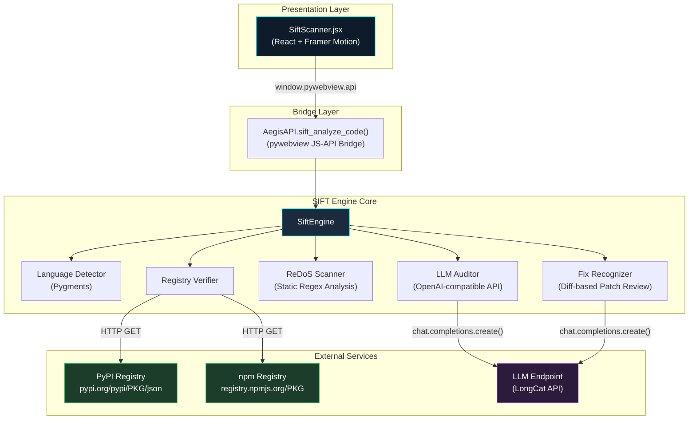
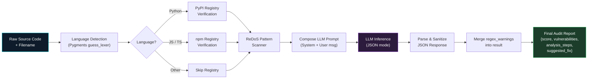
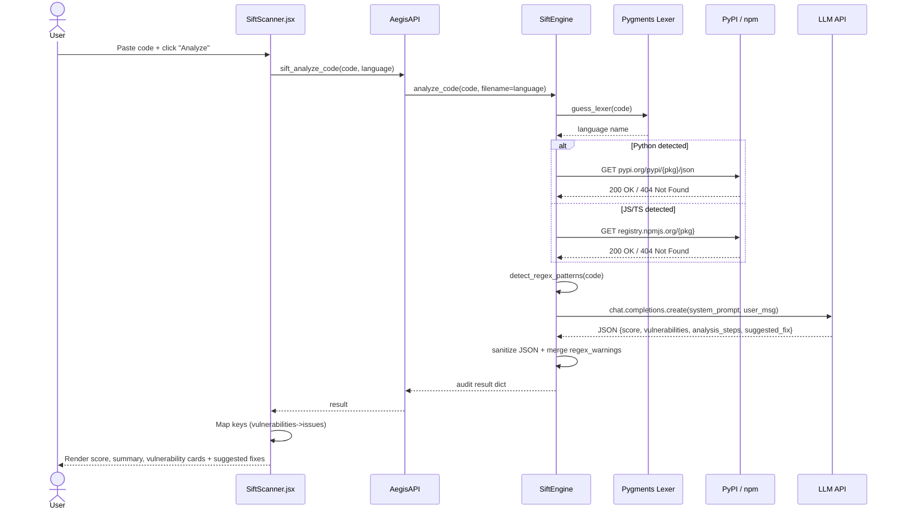
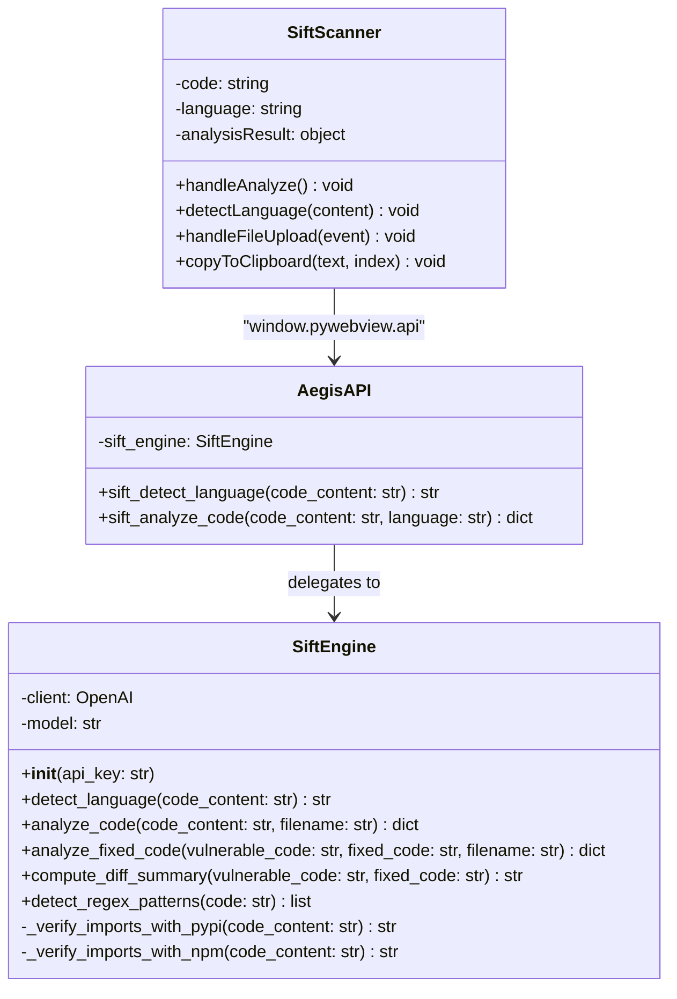
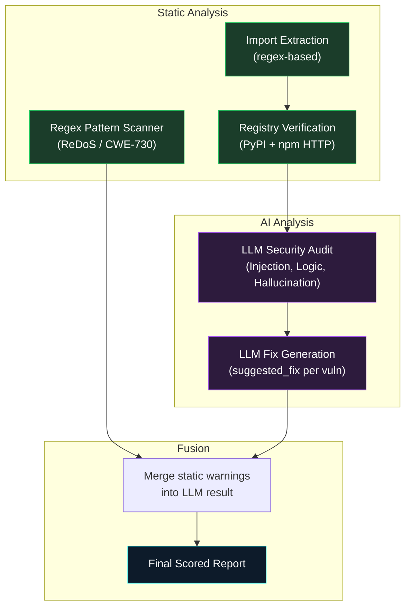
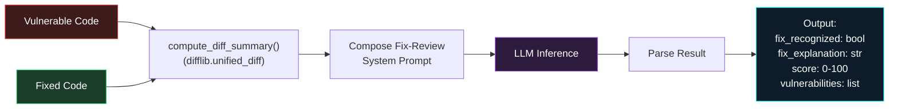
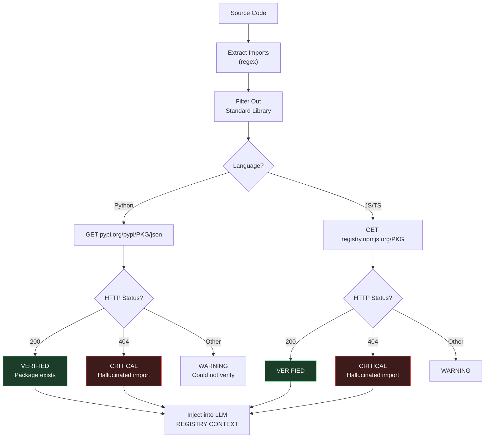

# SIFT Code Auditor -- Architecture and Design Diagrams

All diagrams are written in Mermaid syntax for direct use in research papers, Markdown renderers, or export to SVG/PNG via mermaid.live.

---

## 1. System Architecture (High-Level)

---

## 2. Analysis Pipeline (Data Flow)

---

## 3. Sequence Diagram (End-to-End Audit Flow)

---

## 4. Class Diagram (SiftEngine)

---

## 5. Hybrid Analysis Strategy

---

## 6. Fix-Recognition Pipeline (Patch Review)

---

## 7. Slopsquatting Detection Flow

---

## 8. SIFT Methodology (Research Paper)

```mermaid
flowchart TD
    subgraph "Phase 1: Input Acquisition"
        IN1["User pastes source code\nor uploads file"]
        IN2["Filename / extension\nextracted"]
    end

    subgraph "Phase 2: Language-Aware Preprocessing"
        LP1["Pygments lexical analysis\n(guess_lexer)"]
        LP2{"Detected\nLanguage"}
        LP3["Map to registry\nendpoint"]
    end

    subgraph "Phase 3: Static Analysis (Deterministic)"
        SA1["Regex-based import\nextraction"]
        SA2["Real-time registry\nverification\n(PyPI / npm HTTP)"]
        SA3["ReDoS pattern\ndetection\n(CWE-730)"]
        SA4["Classify each import:\nVERIFIED | NOT FOUND\n| UNKNOWN"]
    end

    subgraph "Phase 4: AI-Driven Analysis (Non-Deterministic)"
        AI1["Construct composite\nLLM prompt"]
        AI2["Inject static context:\n- Registry results\n- Regex warnings"]
        AI3["LLM inference\n(JSON-mode,\nstructured output)"]
        AI4["Vulnerability\nclassification:\nSecurity | Logic |\nHallucination"]
        AI5["Remediation\ngeneration\n(suggested_fix\nper vulnerability)"]
        AI6["Security scoring\n(0-100 scale,\n100 = safe)"]
    end

    subgraph "Phase 5: Report Synthesis"
        RS1["Sanitize and parse\nLLM JSON response"]
        RS2["Merge static\nReDoS warnings"]
        RS3["Final structured\naudit report"]
        RS4["Render to user:\nScore + Summary +\nVulnerability cards +\nSuggested fixes"]
    end

    IN1 --> LP1
    IN2 --> LP1
    LP1 --> LP2
    LP2 -->|"Python"| LP3
    LP2 -->|"JS / TS"| LP3
    LP2 -->|"Other"| SA3
    LP3 --> SA1
    SA1 --> SA2
    SA2 --> SA4
    SA4 --> AI2
    SA3 --> AI2
    AI2 --> AI1
    AI1 --> AI3
    AI3 --> AI4
    AI4 --> AI5
    AI5 --> AI6
    AI6 --> RS1
    RS1 --> RS2
    RS2 --> RS3
    RS3 --> RS4

    style IN1 fill:#0d1b2a,stroke:#00f0ff,color:#fff
    style LP1 fill:#1a2740,stroke:#3b82f6,color:#fff
    style LP2 fill:#1a2740,stroke:#3b82f6,color:#fff
    style SA1 fill:#1b3d2a,stroke:#22c55e,color:#fff
    style SA2 fill:#1b3d2a,stroke:#22c55e,color:#fff
    style SA3 fill:#1b3d2a,stroke:#22c55e,color:#fff
    style SA4 fill:#1b3d2a,stroke:#22c55e,color:#fff
    style AI1 fill:#2d1b3d,stroke:#a855f7,color:#fff
    style AI2 fill:#2d1b3d,stroke:#a855f7,color:#fff
    style AI3 fill:#2d1b3d,stroke:#a855f7,color:#fff
    style AI4 fill:#2d1b3d,stroke:#a855f7,color:#fff
    style AI5 fill:#2d1b3d,stroke:#a855f7,color:#fff
    style AI6 fill:#2d1b3d,stroke:#a855f7,color:#fff
    style RS3 fill:#0d1b2a,stroke:#f59e0b,color:#fff
    style RS4 fill:#0d1b2a,stroke:#f59e0b,color:#fff
```

---

> **Rendering**: Paste any diagram block into [mermaid.live](https://mermaid.live) to get an SVG/PNG export for your paper.
